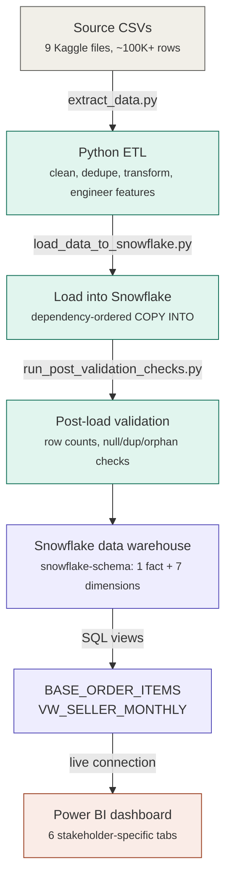
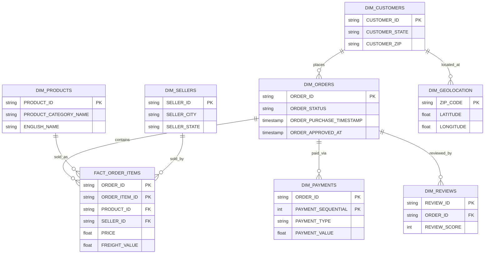

#  OLIST E-Commerce Business Intelligence & Data Warehousing Solution

**A full-stack BI/DW build  Python ETL → Snowflake (snowflake-schema DW) → Power BI  turning 100K+ raw Brazilian e-commerce transactions into an executive decision-support dashboard.**

> Author: Sneha Umrikar · Business Intelligence & Data Warehousing
> 📄 [Full Project Report](E-commerce-BI-and-Data-Warehousing-Solution.pptx) · 📊 [Dashboard Screenshots](3_Dashboard/Screenshot_Dashboard.pdf) · 🗂️ [ER Diagram](ER_Diagram.pdf)

---

##  Table of Contents

1. [Project Overview](#-project-overview)
2. [Business Problem & Objectives](#-business-problem--objectives)
3. [Tech Stack](#-tech-stack)
4. [Dataset](#-dataset)
5. [Architecture](#-architecture)
6. [Data Warehouse Design (Schema)](#-data-warehouse-design-schema)
7. [ETL Pipeline](#-etl-pipeline)
8. [Data Storage Evaluation](#-data-storage-evaluation)
9. [Risk Management & Data Quality](#-risk-management--data-quality)
10. [Dashboard, Key Insights & Recommendations](#-dashboard-key-insights--recommendations)
11. [SQL Skills Showcase](#-sql-skills-showcase)
12. [DAX Measures Showcase](#-dax-measures-showcase)
13. [Repository Structure](#-repository-structure)
14. [How to Run This Project](#-how-to-run-this-project)
---

## Project Overview

Olist, Brazil's largest online marketplace connector, generates order, payment, review, and logistics data across thousands of sellers and customers  but raw transactional CSVs give leadership no way to see revenue trends, regional performance, or *why* delivery delays hurt customer satisfaction.

This project designs and builds a **production-style BI/DW solution end to end**:

- **Extract** 9 relational CSV sources (~100K+ orders, 112K+ order items, 33K+ products)
- **Transform** with Python  data quality fixes, referential-integrity enforcement, feature engineering
- **Load** into a **Snowflake snowflake-schema data warehouse** with validated fact/dimension tables
- **Model** reusable SQL views (`BASE_ORDER_ITEMS`, `VW_SELLER_MONTHLY`) for consistent, pre-aggregated reporting
- **Visualize** in a 6-tab **Power BI executive dashboard** connected live to Snowflake

The result: raw transactional data converted into **stakeholder-ready insights**  revenue trends, regional GMV concentration, delivery-vs-review correlation, and payment behavior  with a full audit trail of data-quality decisions.

---

## Business Problem & Objectives
This project addresses e-commerce analytics challenges using the Olist dataset, supporting evidence-based decision-making.

**Business question:** 
Q 1. Where is Olist's e-commerce revenue concentrated?

Q.2 What is driving customer dissatisfaction?

Q.3 How should logistics, marketing, and payments strategy respond?

**Target audience:** CEO/COO/Investors (executive summary), Marketing, Customer Support, Sales, Supply Chain, and Seller Relations teams  each served by a dedicated dashboard tab.

| # | Objective | Answered by |
|---|-----------|-------------|
| 1 | Design a scalable, analytics-optimized warehouse schema | Snowflake snowflake-schema (fact + dimensions) |
| 2 | Build a repeatable, auditable ETL pipeline with quality controls | Python ETL + post-load validation checks |
| 3 | Evaluate storage/platform options against integrity, security, cost | Relational DB vs. Data Warehouse vs. Cloud storage comparison |
| 4 | Surface revenue, regional, and delivery performance trends | Power BI dashboard (6 stakeholder-specific views) |
| 5 | Convert findings into a prioritized, quantified action plan | Strategic recommendations |

---

## Dataset

**[Brazilian E-Commerce Public Dataset by Olist](https://www.kaggle.com/datasets/olistbr/brazilian-ecommerce)** (Kaggle)

| Attribute | Detail |
|---|---|
| Provider | Olist  largest department store marketplace network in Brazil |
| Time span | 2016 – 2018 |
| Scale | 9 relational CSV files, ~100MB  `orders` (99,441 rows), `order_items` (112,650 rows), `products` (32,951 rows), plus customers, sellers, payments, reviews, geolocation, category translations |
| Grain | One row per order item, joinable up to customer/seller/product/review/payment level |
| Why it fits | Full e-commerce lifecycle (order → payment → logistics → review) enables realistic sales trend, regional clustering, and delivery-satisfaction analysis |

---
## Tech Stack

| Layer | Tools |
|---|---|
| **Data source** | Kaggle  Brazilian E-Commerce Public Dataset by Olist |
| **ETL / scripting** | Python, Pandas, NumPy |
| **Data warehouse** | Snowflake (snowflake-schema, SQL views, `COPY INTO` bulk loading) |
| **Modeling** | Dimensional modeling (Kimball methodology)  1 fact table, 7 dimension tables |
| **Visualization** | Power BI (DAX measure layer, interactive maps, slicers, live Snowflake connection) |
| **Data quality** | Custom Python validation suite (row counts, null/duplicate/orphan checks) |

---

## Architecture



Full flowchart (source doc): [`ETL_Flowchart.pdf`](ETL_Flowchart.pdf)

---

## Data Warehouse Design (Schema)

A **snowflake schema** was implemented in Snowflake  chosen over a flat star schema to normalize dimensions (e.g. product ↔ category translation) and enforce referential integrity across a genuinely relational source dataset.

**Fact table:** `FACT_ORDER_ITEMS` (grain: one row per order item  `ORDER_ID + ORDER_ITEM_ID`)

**Dimension tables:**
| Table | Key | Purpose |
|---|---|---|
| `DIM_ORDERS` | `ORDER_ID` | Order status, purchase/approval timestamps |
| `DIM_CUSTOMERS` | `CUSTOMER_ID` | Customer state, zip, unique ID |
| `DIM_PRODUCTS` | `PRODUCT_ID` | Category, English name, dimensions |
| `DIM_SELLERS` | `SELLER_ID` | Seller city, state, zip |
| `DIM_PAYMENTS` | `ORDER_ID + PAYMENT_SEQUENTIAL` | Type, installments, value |
| `DIM_REVIEWS` | `REVIEW_ID` | Review score & comment |
| `DIM_GEOLOCATION` | `ZIP_CODE + LAT + LONG` | Lat/long, state |



Full ER diagram (source doc): [`ER_Diagram.pdf`](ER_Diagram.pdf)

**Reusable analytical SQL views** (see [`2_ETL_Code/SQL_Code`](2_ETL_Code/SQL_Code)) sit on top of the warehouse so Power BI never re-derives business logic:
- **`BASE_ORDER_ITEMS`**  joins fact + orders + products, computes `GMV_ITEM = PRICE + FREIGHT_VALUE`
- **`VW_SELLER_MONTHLY`**  monthly seller-level GMV, order/item counts, on-time delivery rate, and average review score

---

## ETL Pipeline

Implemented in Python (Pandas), fully modular and independently runnable (see [`2_ETL_Code/Python_Code`](2_ETL_Code/Python_Code)):

| Script | Responsibility |
|---|---|
| `extract_data.py` | Reads all 9 source CSVs into DataFrames with error handling/logging |
| `clean_and_transform_data.py` | Cleans, imputes, dedupes, and transforms each entity into DW-ready form |
| `snowflake_setup.py` | Establishes the Snowflake connection |
| `load_data_to_snowflake.py` | Creates schema/tables and loads data via `COPY INTO`, in dependency order |
| `run_post_validation_checks.py` | Post-load data-quality gate (row counts, null keys, duplicates, orphaned FKs) |
| `call_etl_function.py` | Orchestrates the full pipeline end to end |
| `download_all_tables_to_csv.py` | Exports warehouse tables back to CSV for offline use |

**Key transformation logic:**
- Missing numeric values (e.g. product weight/dimensions) imputed with medians; zero/negative values dropped
- Duplicate reviews removed (`drop_duplicates` on `review_id`); orphaned order-items with no matching order dropped to preserve referential integrity
- Timestamps parsed with `pd.to_datetime(..., errors='coerce')`; accented city names normalized with `unicodedata`
- Product category names translated to English and merged in; payment type values standardized (`boleto` → `bank_slip`)
- Derived fields engineered for analysis: `Month`, `Day`, `Delivery_Delay_Days`, `Bucket_Delay` (e.g. "Very Late" if >7 days late)

Full write-up of every issue found and how it was resolved: [`Data Quality Issues and Resolutions.pdf`](Data%20Quality%20Issues%20and%20Resolutions.pdf)

---

## Data Storage Evaluation

Three storage architectures were formally evaluated against **scalability, integrity risk, security risk, and cost** before selecting Snowflake:

| Method | Scalability | Integrity Risk | Security Risk | Verdict |
|---|---|---|---|---|
| Relational DB (PostgreSQL) | Medium (vertical only) | Duplicate/orphaned records under concurrent writes | SQL injection if misconfigured | Good for OLTP, weak for 100K+ row analytics |
| **Data Warehouse (Snowflake)**  | **High**  elastic, multi-cluster, compute/storage separated | Automated backups, time-travel, versioning | Encryption, RBAC, SOC 2 | **Selected**  built for OLAP at this scale |
| Cloud Object Storage (AWS S3) | High (near-infinite) | No built-in validation; file corruption risk | Public bucket exposure risk | Good as a raw landing zone only, not queryable |

Snowflake was selected for its elastic compute/storage separation, SQL-native access for business users, automated integrity safeguards, and pay-per-use cost model appropriate for variable e-commerce query load.

---

## Risk Management & Data Quality

| Risk | Mitigation | Result |
|---|---|---|
| Nulls/duplicates corrupting metrics (e.g. inflated GMV) | Automated null/duplicate checks + imputation/removal in ETL | Post-validation: no null keys; 1 orphaned `seller_id` found and resolved |
| Broken joins between sources (e.g. mismatched order IDs) | Dependency-ordered loading (dimensions before fact) + referential-integrity drops | 100% referential integrity confirmed post-clean |
| Partial load failures | `ON_ERROR = 'CONTINUE'` in `COPY INTO`, try/except + logging throughout ETL | Failed records logged without halting the pipeline |
| Scalability under growing data volume | Snowflake auto-scaling & compute elasticity | Handles 100K+ records with no degradation |
| Unauthorized data access | Encryption, MFA, role-based access (read-only for BI users) | Aligned to ISO 27001 principles |

---

## Dashboard, Key Insights & Recommendations

Live Power BI dashboard connected directly to Snowflake (`.pbit` file: [`3_Dashboard/MBI807_Assignment_1_Sneha.pbit`](3_Dashboard/MBI807_Assignment_1_Sneha.pbit)), organized into **6 stakeholder-specific tabs**: Executive Summary, Customer & Order, Payment, Delivery, Product, and Seller.

**Executive Summary (CEO / Investor / COO)**


Shows headline KPIs  **16.13M GMV**, **99K customers**, **164.44 average order value**, **3,022 active sellers**, **98K total orders**, and revenue trends by month, year, day of week, and state.

**Customer, Payment & Delivery views**


Break down order status, payment-type mix, and  critically  the **relationship between delivery delay and review score**.


### Key insights & recommendations

| # | Insight (data-backed) | Recommendation |
|---|---|---|
| 1 | Revenue is highly seasonal and weekday-driven  GMV is consistently higher Mon–Fri than weekends and grew steadily through 2017–2018 | Concentrate marketing spend and promotions on weekdays, and staff/inventory planning around the observed seasonal peak |
| 2 | Revenue and sellers are geographically concentrated  São Paulo alone drives **48.15K orders** and the largest GMV share, followed by Rio de Janeiro and Minas Gerais | Prioritize marketing spend and same-day/regional delivery pilots in the Southeast (São Paulo, Rio, Minas Gerais)  highest ROI region for targeted campaigns |
| 3 | Delivery delay directly predicts churn risk  average review score falls from **4.4 (Very Early)** to **1.8 (Very Late)**, making delay the strongest satisfaction signal in the data | Fix logistics in high-delay regions first  prioritize regional carriers and AI-based delivery-time forecasting; treat this as the top operational priority |
| 4 | Payments skew heavily to credit  **73.9%** of payments are credit card (avg. value $163) vs. bank slip (19.0%) and voucher (5.6%); installment plans correlate with higher-value orders | Expand installment options to more product categories and promote debit/voucher more actively to the ~26% of non-credit-card customers |
| 5 | Delivery performance is strong overall  ~99.9% delivery completion rate with minimal cancellations (~550 orders) | Maintain current fulfillment reliability while fixing the delay outliers identified above  don't disrupt what's already working |
| 6 | Category revenue is concentrated in Health & Beauty, Watches & Gifts, and Bed Bath & Table | Double down on marketing/stock for top categories; bundle underperforming categories with top sellers to lift their visibility |
| 7 | Seller performance varies widely across 3,022 active sellers (on-time rate, review score) | Formalize seller performance tracking via `VW_SELLER_MONTHLY`, with targeted training/support for low-performing sellers |

*(Full dashboard screenshots for all 6 tabs: [`3_Dashboard/Screenshot_Dashboard.pdf`](3_Dashboard/Screenshot_Dashboard.pdf))*

---

## SQL

From the warehouse created two  SQL views Power BI always queries consistent, pre-aggregated business logic instead of re-deriving it per-report.

**1. Base analytical view  multi-table join + derived metric**

```sql
-- BASE_ORDER_ITEMS: joins fact + 2 dimensions, computes GMV at the line-item grain
CREATE OR REPLACE VIEW OLIST_DB.OLIST_SCHEMA.BASE_ORDER_ITEMS AS
SELECT
    foi.ORDER_ID,
    foi.PRODUCT_ID,
    foi.SELLER_ID,
    foi.ORDER_ITEM_ID,
    foi.PRICE,
    foi.FREIGHT_VALUE,
    (foi.PRICE + foi.FREIGHT_VALUE) AS GMV_ITEM,
    do.ORDER_STATUS,
    do.ORDER_PURCHASE_TIMESTAMP,
    do.ORDER_DELIVERED_CUSTOMER_DATE,
    do.ORDER_ESTIMATED_DELIVERY_DATE,
    dp.PRODUCT_CATEGORY_NAME
FROM OLIST_DB.OLIST_SCHEMA.FACT_ORDER_ITEMS foi
JOIN OLIST_DB.OLIST_SCHEMA.DIM_ORDERS do
    ON do.ORDER_ID = foi.ORDER_ID
LEFT JOIN OLIST_DB.OLIST_SCHEMA.DIM_PRODUCTS dp
    ON dp.PRODUCT_ID = foi.PRODUCT_ID;
```

**2. Aggregated seller-performance view  CTEs, date-trunc grouping, conditional aggregation**

```sql
-- VW_SELLER_MONTHLY: monthly GMV, on-time delivery rate, and review score per seller
CREATE OR REPLACE VIEW OLIST_DB.OLIST_SCHEMA.VW_SELLER_MONTHLY AS
WITH base AS (
    SELECT
        DATE_TRUNC('month', ORDER_PURCHASE_TIMESTAMP) AS MONTH,
        SELLER_ID,
        COUNT(DISTINCT ORDER_ID)                       AS ORDERS,
        COUNT(*)                                        AS ITEMS,
        SUM(PRICE + FREIGHT_VALUE)                       AS GMV,
        AVG(CASE
                WHEN ORDER_DELIVERED_CUSTOMER_DATE IS NOT NULL
                 AND ORDER_DELIVERED_CUSTOMER_DATE <= ORDER_ESTIMATED_DELIVERY_DATE
                THEN 1 ELSE 0
            END)                                        AS ON_TIME_RATE
    FROM OLIST_DB.OLIST_SCHEMA.BASE_ORDER_ITEMS
    GROUP BY 1, 2
),
reviews AS (
    SELECT foi.SELLER_ID, AVG(dr.REVIEW_SCORE) AS AVG_REVIEW
    FROM OLIST_DB.OLIST_SCHEMA.FACT_ORDER_ITEMS foi
    JOIN OLIST_DB.OLIST_SCHEMA.DIM_REVIEWS dr
        ON dr.ORDER_ID = foi.ORDER_ID
    GROUP BY foi.SELLER_ID
)
SELECT b.MONTH, b.SELLER_ID, b.ORDERS, b.ITEMS, b.GMV, b.ON_TIME_RATE, r.AVG_REVIEW
FROM base b
LEFT JOIN reviews r ON r.SELLER_ID = b.SELLER_ID
ORDER BY b.MONTH, b.SELLER_ID;
```

Full source: [`2_ETL_Code/SQL_Code`](2_ETL_Code/SQL_Code)

---

## DAX Measures

Power BI semantic model defines its own measure layer in DAX  so every KPI on the dashboard (GMV, AOV, on-time rate, active sellers, etc.) is computed consistently from a single defined measure rather than recalculated per visual.

```dax
DEFINE
    -- Row-context iteration: sums a derived expression across every order-item row
    MEASURE 'FACT_ORDER_ITEMS'[Gross Merchandise Value] =
        SUMX(FACT_ORDER_ITEMS, 'FACT_ORDER_ITEMS'[PRICE] + 'FACT_ORDER_ITEMS'[FREIGHT_VALUE])

    -- Distinct counts across the grain of the fact table (order items, not orders)
    MEASURE 'FACT_ORDER_ITEMS'[Total Orders]     = DISTINCTCOUNT('DIM_ORDERS'[ORDER_ID])
    MEASURE 'FACT_ORDER_ITEMS'[Active Customers] = DISTINCTCOUNT('DIM_ORDERS'[CUSTOMER_ID])
    MEASURE 'FACT_ORDER_ITEMS'[Active Sellers]   = DISTINCTCOUNT('FACT_ORDER_ITEMS'[SELLER_ID])

    -- Measure-to-measure composition with safe division (DIVIDE handles the /0 case)
    MEASURE 'FACT_ORDER_ITEMS'[Average Order Value] =
        DIVIDE([Gross Merchandise Value], [Total Orders])

    -- CALCULATE + ALLEXCEPT: recomputes MIN date per customer, ignoring all other
    -- active filters except CUSTOMER_ID  used to derive each customer's cohort date
    MEASURE 'DIM_ORDERS'[First Purchase Date] =
        CALCULATE(
            MIN('DIM_ORDERS'[ORDER_PURCHASE_TIMESTAMP]),
            ALLEXCEPT(DIM_ORDERS, 'DIM_ORDERS'[CUSTOMER_ID])
        )

    -- Conditional CALCULATE with a boolean filter + a NOT/ISBLANK guard on the
    -- denominator so orders that haven't delivered yet don't distort the rate
    MEASURE 'FACT_ORDER_ITEMS'[On Time Delivery %] =
        DIVIDE(
            CALCULATE(
                COUNTROWS(DIM_ORDERS),
                'DIM_ORDERS'[ORDER_DELIVERED_CUSTOMER_DATE] <= 'DIM_ORDERS'[ORDER_ESTIMATED_DELIVERY_DATE]
            ),
            CALCULATE(
                COUNTROWS(DIM_ORDERS),
                NOT(ISBLANK('DIM_ORDERS'[ORDER_DELIVERED_CUSTOMER_DATE]))
            )
        )
```

Full model: [`3_Dashboard/MBI807_Assignment_1_Sneha.pbit`](3_Dashboard/MBI807_Assignment_1_Sneha.pbit)

---

## Repository Structure

```
OLIST_Ecommerce_BI_DW_Solution/
│
├── 1_Dataset/
│   ├── Raw_Data/                          # Source CSVs (Kaggle Olist dataset)
│   └── download_all_tables_to_csv.py      # Export Snowflake tables back to CSV
│
├── 2_ETL_Code/
│   ├── Python_Code/
│   │   ├── extract_data.py                # Extract: CSV → DataFrames
│   │   ├── clean_and_transform_data.py    # Transform: cleaning, feature engineering
│   │   ├── snowflake_setup.py             # Snowflake connection setup
│   │   ├── load_data_to_snowflake.py      # Load: dependency-ordered COPY INTO
│   │   ├── run_post_validation_checks.py  # Post-load data quality gate
│   │   └── call_etl_function.py           # Full pipeline orchestration
│   ├── SQL_Code/
│   │   ├── BASE_ORDER_ITEMS.sql           # Core analytical view
│   │   └── View_SELLER_MONTHLY.sql        # Seller performance view
│   └── brazil-states.json                 # GeoJSON for Power BI state mapping
│
├── 3_Dashboard/
│   ├── MBI807_Assignment_1_Sneha.pbit     # Power BI template (live Snowflake connection)
│   └── Screenshot_Dashboard.pdf           # All 6 dashboard tabs
│
├── 5_Instructions/
│   ├── Set_up_and_run_instruction.pdf     # Environment & pipeline setup guide
│   └── Navigate_Dashboard.pdf             # Dashboard user guide
│
├── ER_Diagram.pdf                          # Snowflake-schema entity relationship diagram
├── ETL_Flowchart.pdf                       # End-to-end pipeline flowchart
├── Data Quality Issues and Resolutions.pdf # Full data-quality audit trail
├── E-commerce-BI-and-Data-Warehousing-Solution.pptx  # Stakeholder presentation
├── LICENSE
└── README.md
```

---

## How to Run This Project

**1. Clone the repository**
```bash
git clone https://github.com/UmrikarS/OLIST_Ecommerce_BI_DW_Solution.git
cd OLIST_Ecommerce_BI_DW_Solution
```

**2. Install dependencies**
```bash
pip install pandas numpy snowflake-connector-python
```

**3. Configure Snowflake credentials**

Update `2_ETL_Code/Python_Code/snowflake_setup.py` with your Snowflake account, warehouse, and role details.

**4. Run the ETL pipeline**
```bash
python 2_ETL_Code/Python_Code/call_etl_function.py
```
This extracts the raw CSVs, cleans/transforms them, loads them into Snowflake in dependency order, and runs the post-load validation checks automatically.

**5. Build the SQL views**

Run [`BASE_ORDER_ITEMS.sql`](2_ETL_Code/SQL_Code/BASE_ORDER_ITEMS.sql) and [`View_SELLER_MONTHLY.sql`](2_ETL_Code/SQL_Code/View_SELLER_MONTHLY.sql) in your Snowflake worksheet.

**6. Open the dashboard**

Open [`3_Dashboard/MBI807_Assignment_1_Sneha.pbit`](3_Dashboard/MBI807_Assignment_1_Sneha.pbit) in Power BI Desktop, connect it to your Snowflake instance (`OLIST_DB.OLIST_SCHEMA`), and refresh.

Detailed setup instructions: [`5_Instructions/Set_up_and_run_instruction.pdf`](5_Instructions/Set_up_and_run_instruction.pdf)

---

